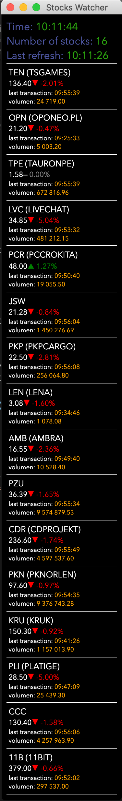

# GPW Stocks Watcher

Simple electron App to watch constantly of current price of Stocks on [GPW](https://www.gpw.pl/).

Sample view: 

<p align="center">
  
</p>

## Features

* Data is taken from [https://www.biznesradar.pl](https://www.biznesradar.pl)
* Refresh is done each 100s, but it's configurable via `~/.stocks.json` file. see: [configuration](#configure-gpw-stocks-watcher)
* Stocks shown in App might be changed via `~/.stocks.json` file. see: [configuration](#configure-gpw-stocks-watcher)

## Run GPW Stocks Watcher

### Prerequistists

Installed and configured:

* `npm` and `node`

### Install dependencies

```bash
npm install
```

### Launch Stocks Watcher

```bash
npm start
```

### Build Stocks Watcher as single file to run on different OSes

```bash
npm start
```

## Configure GPW Stocks Watcher

There are 2 things which might be configurable in GPW Stocks Watcher:

* `refreshInterval` - value describes how often `Stocks Watcher` will fetch data from server.
* `stocks` - array of stock elements where each of them describes Stock which will be fetched and shown in application. ID value is taken from file `api.json` to set proper ID you need to open file `api.json` find proper Stock in which you are interested and copy field: `oid` as `id` in stocks.json.

Example file with configuration:

```bash
{
  "refreshInterval": 100,
  "stocks": [
    {
      "name": "Livechat",
      "id": "9537",
      "lastPrice": 0.0,
      "meta": {}
    },
    {
      "name": "Ambra",
      "id": "221",
      "lastPrice": 0.0,
      "meta": {}
    }
}
```
